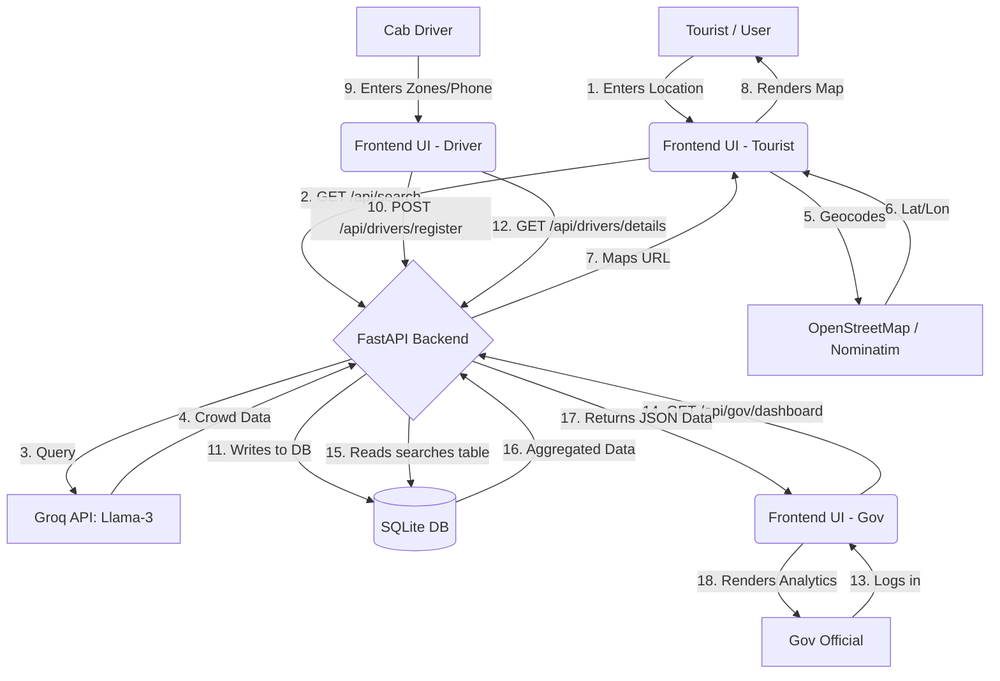
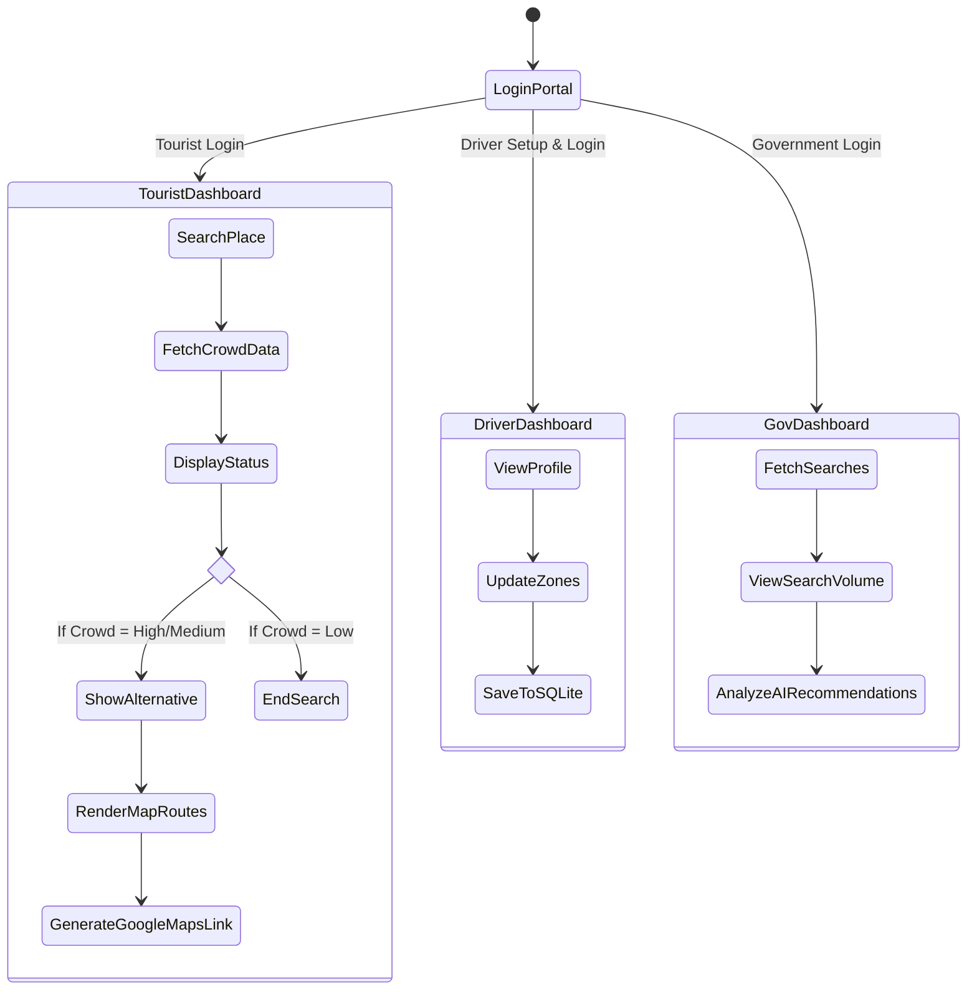

# 🏖️ CrowdClear AI: Smart Tourism & Governance

## 📖 Project Overview
Unpredictable tourist surges at popular beaches and attractions lead to severe traffic congestion, poor visitor experiences, and a strain on local resources. **CrowdClear AI** is a smart, web-based dashboard that predicts crowd levels at major attractions in real-time and suggests alternative, less-crowded routes to evenly distribute tourist footfall.

**Theme:** AI for Smart Communities & Governance
**Problem Statement:** Smart tourism tool to predict crowd levels at beaches/attractions and suggest optimal visitor routing.

---

## ✨ Key Functionalities
* **Real-Time Crowd Intelligence:** Uses the Groq Llama-3 API to generate live, context-aware crowd predictions based on time and geographic location.
* **Smart Alternative Routing:** Automatically suggests lesser-known, nearby alternative spots when primary locations are at peak capacity.
* **Integrated Navigation:** Seamlessly converts AI suggestions into Google Maps driving directions using the user's live GPS location.
* **Interactive Mapping:** Utilizes Leaflet.js and OpenStreetMap (Nominatim) to dynamically geocode locations and render visual markers and routes.
* **Local Cab Integration:** A dedicated portal and dashboard connecting tourists with registered local cab drivers, allowing drivers to manage their operational zones natively.
* **Smart Governance Dashboard:** A dedicated secure portal for government officials to track live search volumes, assess crowd hotspots, and receive AI-driven recommendations for traffic police deployment and bin cleaning schedules.

---

## 🏗️ Project Architecture & Diagrams

### 1. Data Flow Diagram (DFD)
The following Data Flow Diagram illustrates how information moves through the CrowdClear AI system, from the tourist's initial query to the AI prediction and map rendering.



### 2. Activity Diagram
This diagram maps the user journey and system activities for Tourists, Cab Drivers, and Government Officials.



---

## 🛠️ Technology Stack
* **Frontend:** Vanilla JavaScript, HTML5, CSS3 (Glassmorphism UI), Leaflet.js
* **Backend:** Python, FastAPI, Uvicorn
* **Database:** SQLite3
* **AI & Machine Learning:** Groq API (llama-3.3-70b-versatile)
* **External APIs:** Nominatim (OpenStreetMap Geocoding), Google Maps Universal Links

---

## 🚀 Setup and Installation Guide
Follow these steps to run the project locally on your machine.

**1. Clone the repository**
```bash
git clone [https://github.com/Alister82/hackwarz-2k26.git](https://github.com/Alister82/hackwarz-2k26.git)
cd hackwarz-2k26
```

**2. Set up the Python Virtual Environment**
```bash
python -m venv venv
# On Windows:
venv\Scripts\activate
# On macOS/Linux:
source venv/bin/activate
```

**3. Install Dependencies**
```bash
pip install fastapi uvicorn pydantic pytz groq
```

**4. Configure Environment Variables**
Create a `.env` file in the root directory and add your Groq API Key:
```env
GROQ_API_KEY=gsk_your_actual_api_key_here
```

**5. Start the FastAPI Server**
```bash
uvicorn main:app --reload
```

**6. Launch the Frontend**
Open the `frontend/login.html` file in any modern web browser to access the application.

**7. Access Government Command Center**
1. On the login page, click the red **🏛️ Gov Portal** toggle link.
2. Enter credentials:
   - Username: `gov`
   - Password: `gov123`
3. Click Secure Login to view live traffic analytics and AI deployment recommendations based on search density.

**8. Access Driver Profile**
1. On the login page, click the **I am a Cab Driver →** link.
2. Enter your Phone Number, Name, and Operating Zones to dynamically login or register.
3. Access your secure dashboard to natively update and manage your operating areas, adjusting map markers dynamically.

---

## 🤖 Technical Integrity & AI Policy Disclosure
In compliance with the hackathon's Technical Integrity & AI Policy, the following AI tools were utilized during the development of this project:

* **Groq API (Llama-3.3-70b-versatile):** Used natively within the application backend. Its purpose is to process real-time time/location data and generate predictive JSON objects detailing crowd density, trends, and alternative travel suggestions.
* **Google Gemini 3.1 Pro:** Used during the initial brainstorming phase for project architecture planning, boilerplate FastAPI setup, and debugging CORS middleware issues.
* **Antigravity (VS Code Open Agent Manager):** Used within the IDE for rapid code refactoring, identifying API integration errors, and structuring the JavaScript Leaflet map rendering logic.
* **AI-Generated Sections:** The core algorithmic prompt located in `main.py` (under the `/api/search` route) and the dynamic UI rendering logic in `app.js` (specifically the Leaflet marker generation) were heavily co-authored with AI assistance to ensure strict JSON adherence and rapid deployment.